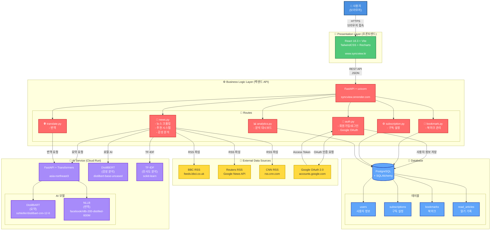
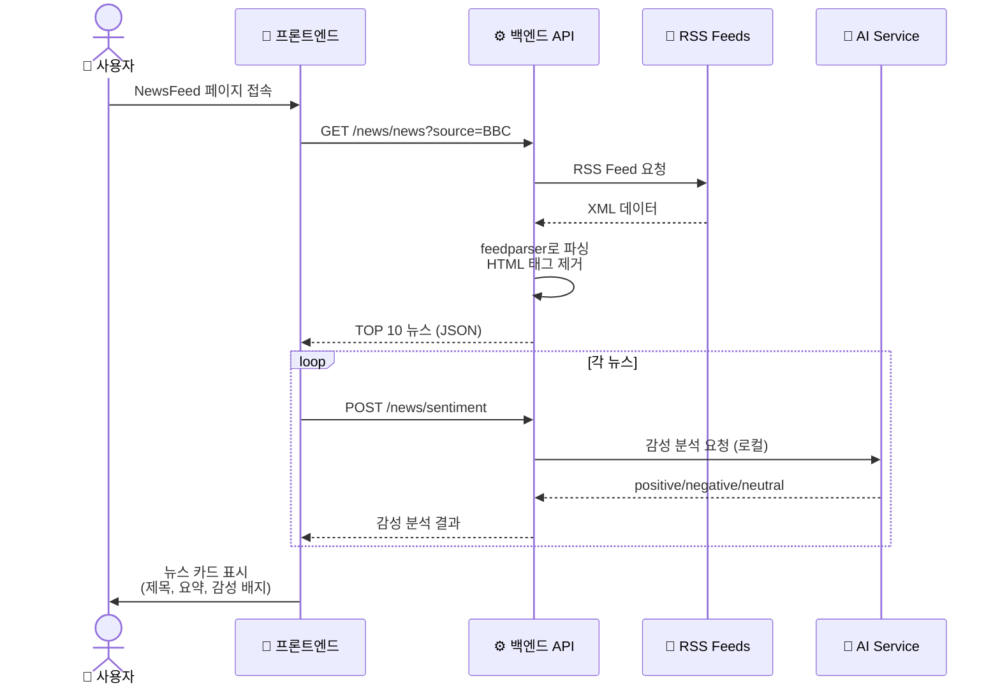
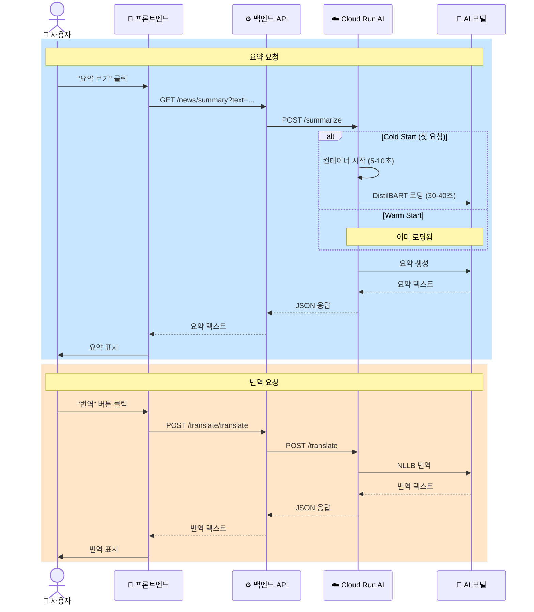
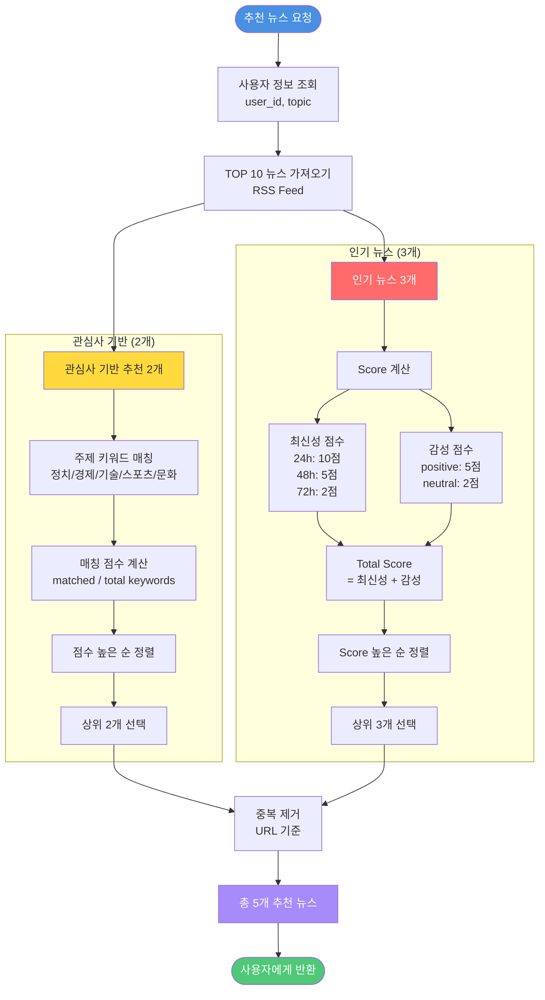
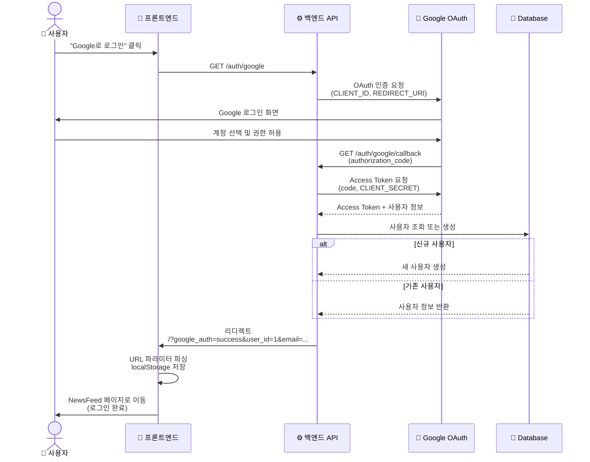
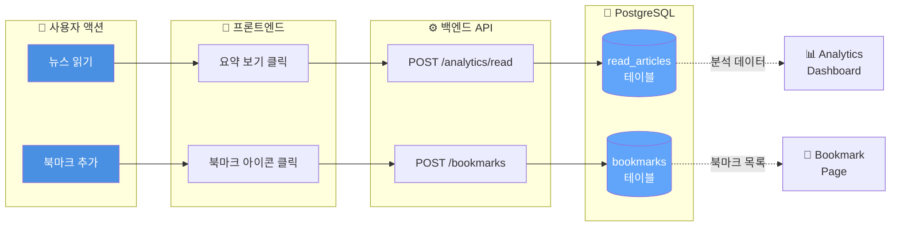
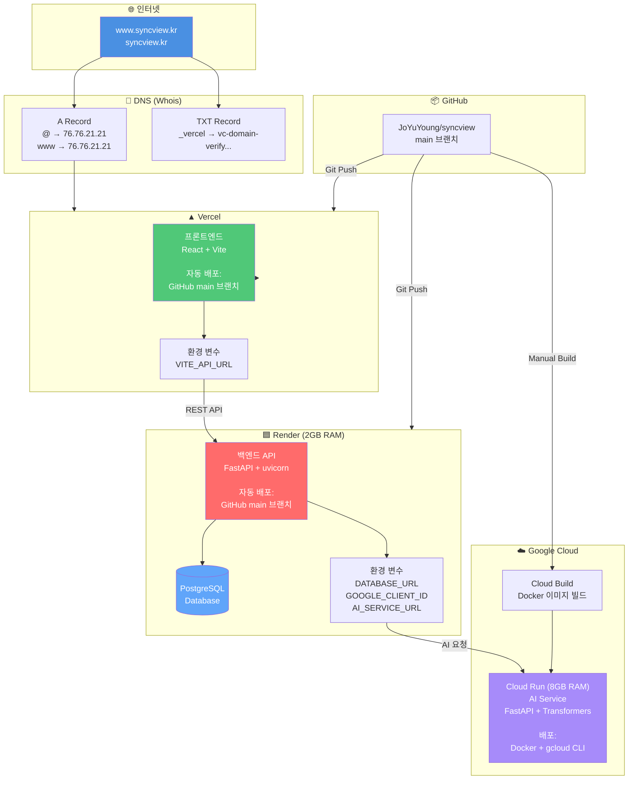

# SyncView 시스템 아키텍처

## 전체 시스템 구성도

---

## 상세 데이터 흐름

### 1. 뉴스 크롤링 및 표시 흐름

---

### 2. AI 요약 및 번역 흐름

---

### 3. 추천 뉴스 알고리즘 흐름

---

### 4. Google OAuth 인증 흐름

---

### 5. 북마크 및 읽기 기록 흐름

---

## 배포 인프라 아키텍처

---

## 기술 스택 상세

### 프론트엔드
- **프레임워크**: React 18.3
- **빌드 도구**: Vite
- **스타일링**: TailwindCSS
- **차트**: Recharts
- **라우팅**: React Router DOM
- **상태 관리**: useState, useEffect, localStorage
- **배포**: Vercel

### 백엔드
- **프레임워크**: FastAPI
- **서버**: uvicorn
- **ORM**: SQLAlchemy
- **인증**: bcrypt, Google OAuth 2.0 (Authlib)
- **RSS 파싱**: feedparser
- **HTML 파싱**: BeautifulSoup4
- **배포**: Render (2GB RAM)

### AI/ML
- **감성 분석**: distilbert-base-uncased-finetuned-sst-2-english
- **요약**: sshleifer/distilbart-cnn-12-6
- **번역**: facebook/nllb-200-distilled-600M
- **유사도 분석**: TF-IDF (scikit-learn)
- **프레임워크**: Transformers (Hugging Face)
- **배포**: Google Cloud Run (8GB RAM)

### 데이터베이스
- **DBMS**: PostgreSQL 16
- **ORM**: SQLAlchemy
- **호스팅**: Render

### 인프라
- **프론트엔드**: Vercel
- **백엔드**: Render (Web Service)
- **AI 서비스**: Google Cloud Run
- **데이터베이스**: Render PostgreSQL
- **도메인**: syncview.kr (Whois)
- **CI/CD**: GitHub Auto-Deploy

---

## 성능 지표

### 응답 시간
- **뉴스 크롤링**: ~2초
- **감성 분석**: ~1-3초 (로컬 AI)
- **요약 생성**:
  - Cold Start: ~50-90초
  - Warm Start: ~5-10초
- **번역**:
  - Cold Start: ~50-90초
  - Warm Start: ~5-10초

### 타임아웃 설정
- **백엔드 → AI Service**: 120초
- **Cloud Run 실행**: 600초 (10분)
- **브라우저 타임아웃**: 없음 (fetch API)

### 메모리 사용량
- **Render 백엔드**: 2GB (Standard Plan)
- **Cloud Run AI**: 8GB (Professional)
- **PostgreSQL**: Render 관리형

---

## 보안

### 인증 및 권한
- **비밀번호**: bcrypt 암호화 (cost factor: 12)
- **OAuth**: Google OAuth 2.0, CSRF 보호
- **세션**: SessionMiddleware, HTTPS 전용

### CORS 정책
- **허용 Origin**:
  - https://www.syncview.kr
  - https://syncview.kr
  - https://syncview-blond.vercel.app
  - http://localhost:5173 (개발)

### 환경 변수
- **민감 정보 보호**: .env, Render 환경 변수
- **Git 제외**: .gitignore

### HTTPS
- **모든 통신 암호화**: Vercel, Render, Cloud Run 자동 SSL

---

## 확장 가능성

### 단기 (1-3개월)
- 뉴스 소스 확장 (AP, NYT, Guardian)
- 다국어 지원 (일본어, 중국어)
- AI 모델 개선 (GPT 기반 요약)

### 중기 (3-6개월)
- 실시간 알림 (Push Notification)
- 소셜 기능 (뉴스 공유, 댓글)
- 프리미엄 기능

### 장기 (6개월+)
- 모바일 앱 (React Native)
- 기업용 솔루션
- AI Chatbot

---

## 모니터링 및 로깅

### 로그 수집
- **Render**: 서버 로그 (uvicorn, FastAPI)
- **Cloud Run**: AI 서비스 로그
- **Vercel**: 배포 로그

### 에러 추적
- **HTTP 상태 코드**: 400, 401, 404, 500, 502, 503, 504
- **예외 처리**: try-except, HTTPException
- **로깅 레벨**: INFO, WARNING, ERROR

---

## 라이선스

Copyright © 2025 SyncView. All rights reserved.

